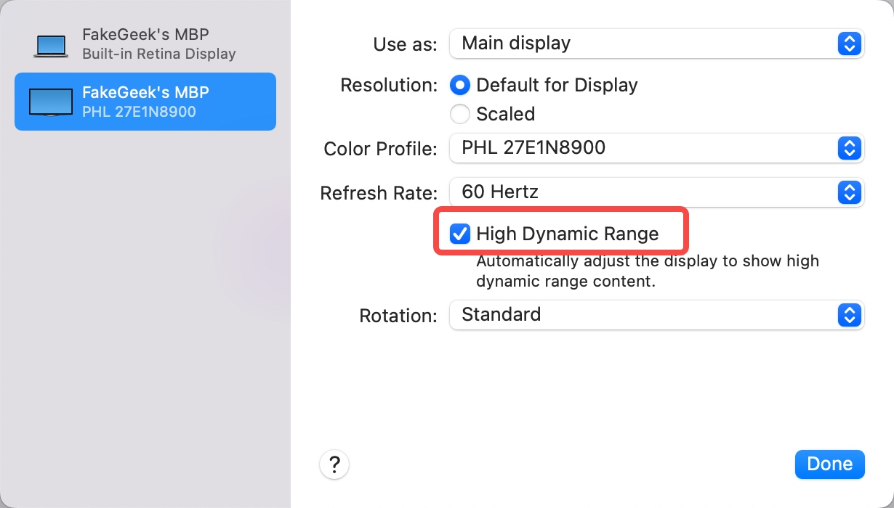
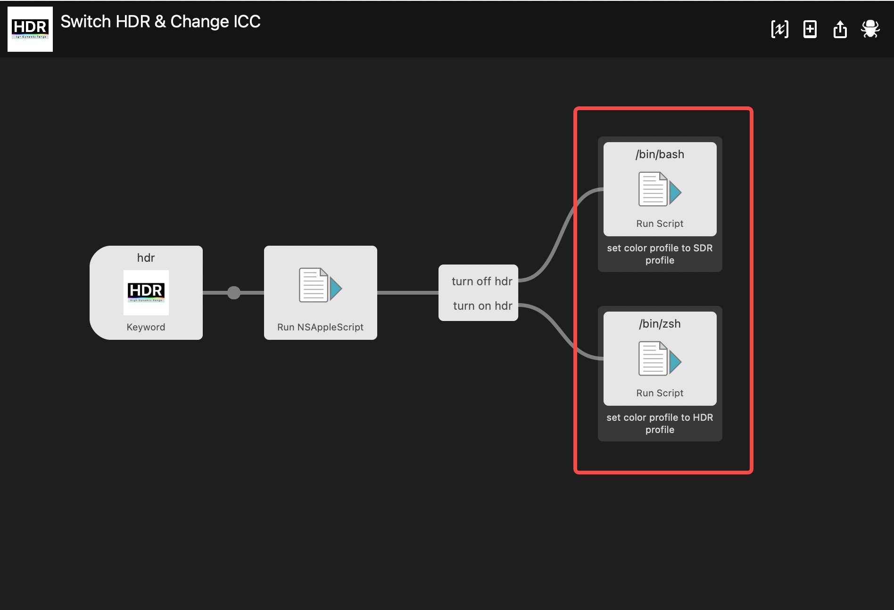
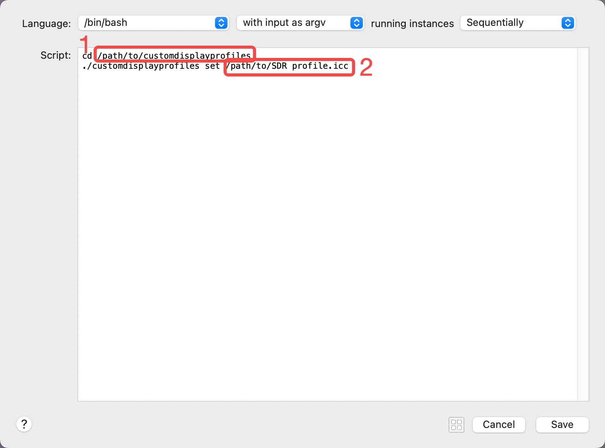

# Switch HDR and Change ICC on macOS

# About
When you use an HDR monitor, macOS can turn on the "High Dynamic Range" option in "System Preferences" Displays for those HDR contents.

But not like mac's original monitors. They can't turn on/off automatically when HDR content shows. You can only open them manually by clicking many times, which is not convenient.

Also, I use different ICC color profiles for HDR and SDR modes. I need to change the profile every time when I turn on/off HDR mode.

Using this Alfred workflow, you can switch HDR and change different ICC color profiles for SDR and HDR mode by one keyword.

# How to use
## Only switch HDR
- Download "HDR switch.workflow"
- or use "Switch HDR.AppleScript" code to create a system shortcut. For how to create shortcuts, see this [readme](https://github.com/ppkantorski/macOS-HDR-Toggler#how-to-use-program).

## Switch HDR and change ICC
- Download "Switch HDR&Change ICC. workflow"
- Download "customdisplayprofiles"
- Open workflow and custom your "customdisplayprofiles" path and your HDR and SDR ICC path

# Thanks
The HDR-Toggler is inspired by:
https://github.com/ppkantorski/macOS-HDR-Toggler

ICC profiles changer is from:
https://github.com/timsutton/customdisplayprofiles/tree/pyinstaller

If "customdisplayprofiles" won't work, you can download code from the original repo and build it yourself.